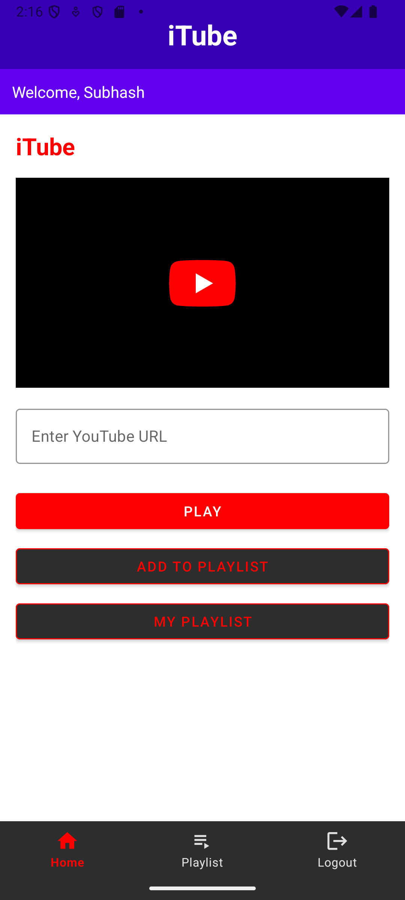
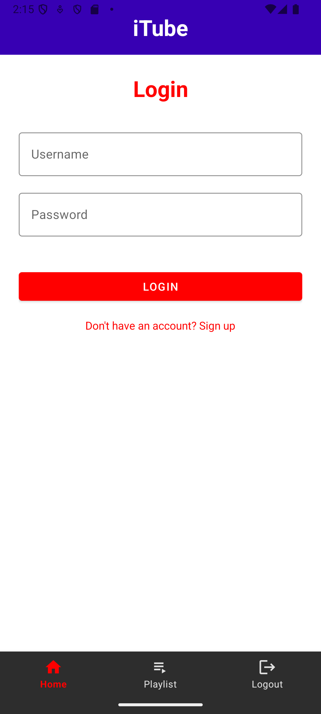
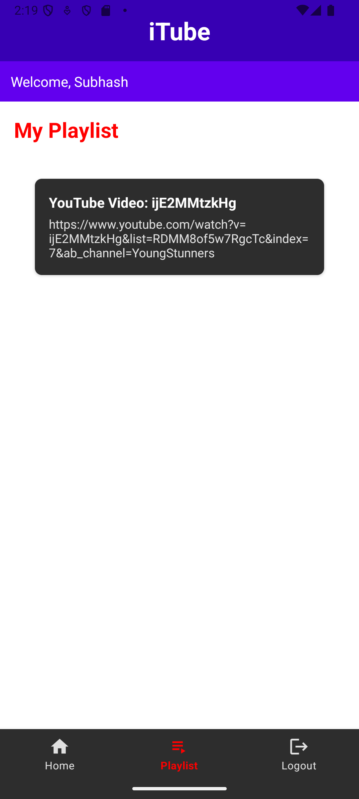
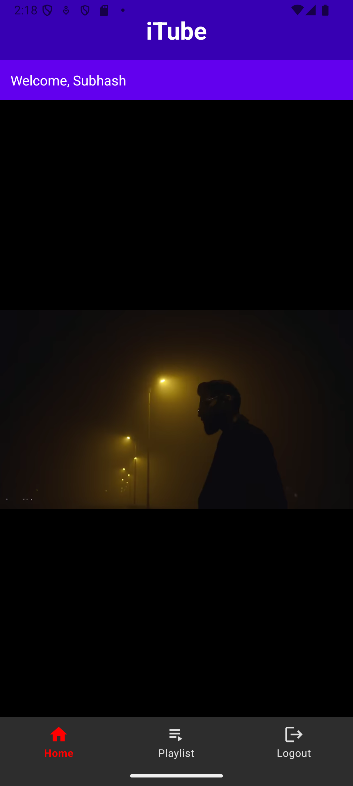

# iTube App ▶️



A YouTube video player app with playlist management capabilities, allowing users to watch videos and save them to personalized playlists.

## Features ✨

- **YouTube Video Playback** - Watch any YouTube video by entering its URL
- **Personal Playlists** - Save favorite videos to your account
- **User Accounts** - Secure login/signup system
- **Clean Interface** - Simple and intuitive UI
- **Responsive Design** - Works across different device sizes

## Screenshots 📸

| Login Screen | Home Screen |
|--------------|-------------|
|  |  |

| Playlist | Video Playback |
|----------|----------------|
|  |  |

## Technical Implementation ⚙️

### Core Components
- **Fragments**:
  - `HomeFragment` - Main video player interface
  - `PlaylistFragment` - Manage saved videos
  - `LoginFragment` & `SignUpFragment` - User authentication
  - `PlayerFragment` - Dedicated video playback

- **Database**:
  - SQLite database for user accounts and playlists
  - `DatabaseHelper` class managing all data operations

- **YouTube Integration**:
  - `android-youtube-player` library for video playback
  - URL parsing to extract video IDs

### Libraries Used
- [android-youtube-player](https://github.com/PierfrancescoSoffritti/android-youtube-player) - For YouTube video playback
- AndroidX - Modern Android components
- View Binding - Type-safe view references

## Setup Instructions 🛠️

1. Clone the repository:
   ```bash
   git clone https://github.com/SubhashSainani/itube-app.git
